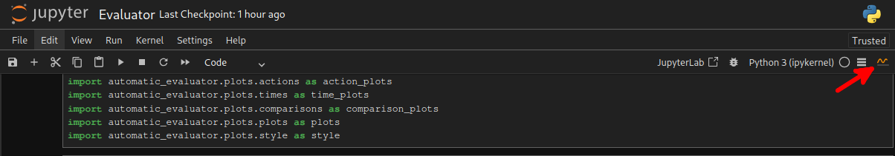

# HackAtari Automatic Evaluator

The main goal of this work is to develop an open benchmarking tool for testing the robustness of the Reinforcement Learning agents on atari games. It is in a form of a Jupyter notebook making it fairly easy for someone without any knowldge of Hackatari to evaluate their models


## Installation
To install the HackAtari Automatic Evaluator environment, please follow these instructions:

1. Create a virtual environment and install the packages
   
```bash
python -m venv env
```

To activate the virtual environment:
- On Windows:
  ```bash
  env\Scripts\activate
  ```
- On Unix/Linux/MacOS:
  ```bash
  source env/bin/activate
  ```


2. Install the Hackatari library by cloning this repository and run the following command:
```bash
git clone https://github.com/PaladinMorak/HackAtari.git
cd HackAtari
pip install -e .
pip install "gymnasium[atari, accept-rom-license]"
```

3. Run the notebook
```bash
jupyter notebook automatic_evaluator/Evaluator.ipynb
```

4. The Jupyter notebook will open. To run the interactive web page renderd with Voila you will need to press the small graph Icon in the top right corner of the notebook.

