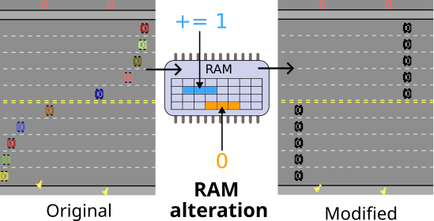

.. HackAtari documentation master file, created by
   sphinx-quickstart on Fri Jun  9 20:50:33 2023.
   You can adapt this file completely to your liking, but it should at least
   contain the root `toctree` directive.

=====================================
Welcome to HackAtari's documentation!
=====================================

.. highlight:: python

.. container:: twocol

   .. container:: leftside

      HackAtari is a wrapper around the OCAtari environments available in gymnasium. 
      It allows you to play altered versions of the Atari games.
      It alters the RAM of the game to create novel game dynamics, allowing for a wide range of variations.
      HackAtari environments also allow for object-centric Reinforcement Learning, as it is built upon `OC_Atari <https://github.com/k4ntz/OC_Atari>`_ .
      OCAtari automatically extracts the objects that exists in the state, 
      either via looking up their attribute in the RAM (fast), or using vision processing methods. 

   .. container:: rightside

      |changeram| 

Cite our work
=============
If you are using HackAtari for your scientific work, please cite us:

.. code:: bibtex
   
   @inproceedings{Delfosse2023HackAtariIV,
      title={HackAtari: Introducing Variations to Atari Reinforcement Learning Environments},
      author={Quentin Delfosse and Jannis Bluml and Bjarne Gregori and Kristian Kersting},
      year={2024}
   }

Requirements
============
This project depends on:

- ocatar: https://github.com/k4ntz/OC_Atari

Download and install:
You can download from the
`Github <https://github.com/k4ntz/HackAtari>`_ repository or:

::

    pip install hackatari

.. toctree::
   :hidden:
   :maxdepth: 2
   :caption: API:

   hackatari/core.rst

.. toctree::
   :hidden:
   :maxdepth: 1
   :caption: Games:
   :titlesonly:
   :glob:

   hackatari/games/*

Indices and tables
==================

* :ref:`genindex`
* :ref:`modindex`
* :ref:`search`
